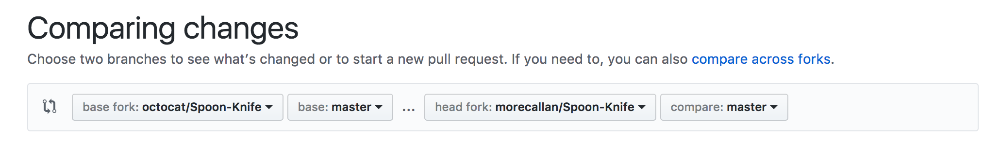
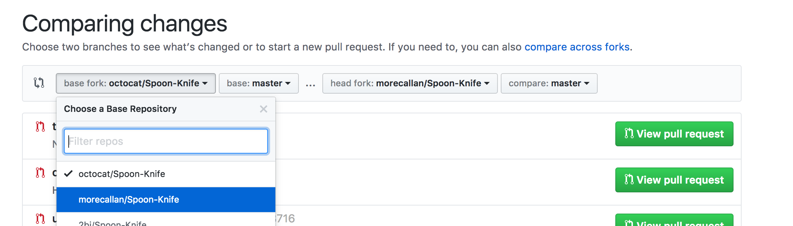
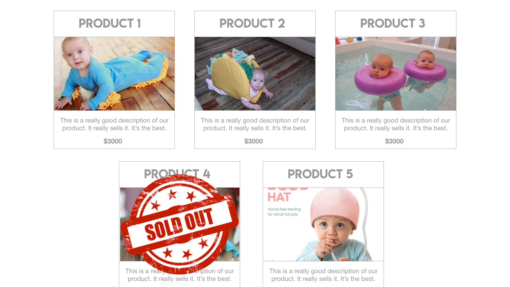

# CSS 102
> A lesson in box model, flexbox and advanced positioning. Boilerplate code provided.

### Setup:
This project provides you initial boilerplate images and HTML structure. In order to use this to begin your project, you will need to follow a process called [forking](https://help.github.com/articles/fork-a-repo/) on GitHub.

###### What is forking?
A fork is a copy of a repository. Forking a repository allows you to freely experiment with changes without affecting the original project. In this example, it's a way for you to get the initial files from MY GitHub repository and use them as a starting point of your own.

### Setup Steps:

1. ###### Fork [my repository](https://github.com/morecallan/css102-e6)
     
   This will essentially create a copy of my GitHub repository as a new repository under your GitHub account.
2. ###### Clone the your new repository to your local machine
     
     
   Make sure to use the SSH option when cloning.
3. ###### Navigate to the project on your local machine
  ```bash
  $ cd ~/workspace/inclass/thestaticweb
  $ git clone https://github.com/YOUR-USERNAME/css102-e6
  $ cd css102-e6
  ```  
4. ###### Evaluate, plan, and break it into features.
   We've already been provided with an end goal for this project. Our product owner has handed us a design that we have to replicate visually. Before we jump in and start coding, we need to plan it out.
5. ###### Create a feature branch and clone.
   Because we've already done the initial setup for this project (provided in the [boilerplate](https://en.wikipedia.org/wiki/Boilerplate_code) from the repository we forked and cloned), we can jump right in and create a new branch and get to working on our first feature.
6. ###### :warning: WARNING: Pull Requests are about to get weird.
*   You are used to doing pull requests to your OWN master branch. Whenever you fork a repository, the default is for the pull request to be made against the ORIGINAL owner's master branch (in this case, mine).  
*   Now, when you go to create a pull request, you'll be prompted to compare changes to the "base fork" (for now, you should always change this to YOUR username/reponame):  
   
   


### This is what the designer gave us to create:


### Resources:
- [Box Model](https://internetingishard.com/html-and-css/css-box-model/)
- [Intro to Flexbox](https://internetingishard.com/html-and-css/flexbox/)
- [Flexbox Properties](https://css-tricks.com/snippets/css/a-guide-to-flexbox/)
- [Flexbox Game](http://flexboxfroggy.com/)
- [Advanced positioning](https://internetingishard.com/html-and-css/advanced-positioning/)
